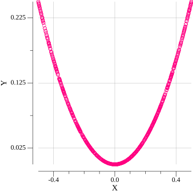
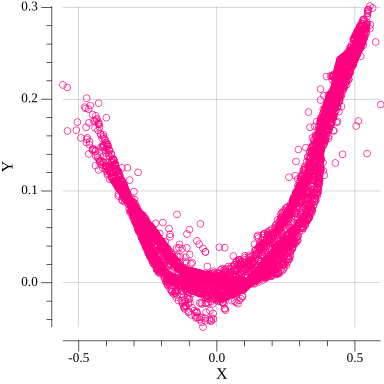
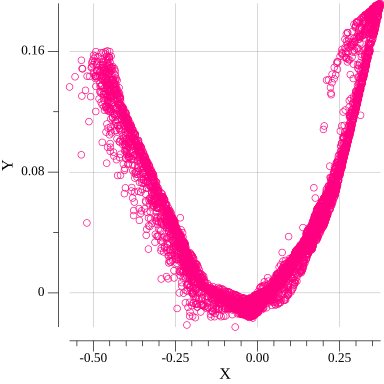
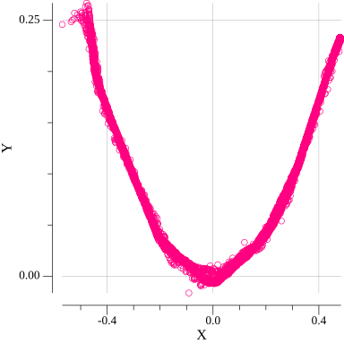

# Generative adversarial networks
**Recipe for simple GAN in Golang ecosystem**


## Table of Contents

- [About](#about)
- [Why](#why)
- [Instruments](#instruments)
- [Usage](#usage)
- [Support and contributing](#support-and-contributing)

## About
This just a repository with simple example how to build GAN in [Gorgonia](https://gorgonia.org/)

What is GAN? 
* Short: such networks are just two neural networks (**Discriminator** and **Generator**) contesting each other. **Generator** must "cheat" on **Discriminator** and the last one should detect lies.
* Long: Wiki-page about GAN's - https://en.wikipedia.org/wiki/Generative_adversarial_network

_Note_: *although there is code with some wrappings/aliasing and helping abstractions and functions in repository, this does not pretend to be high-level machine learning framework*

_Note #2_: *By the way... Code is ugly since I've decided to handle errors instead of using panic(...) calls. Panicing is considered to be in main functions only*

## Why
Just want to do that in Golang ecosystem.

## Instruments
Code is written on Golang - https://golang.org/

Used machine learning library - [Gorgonia](https://github.com/gorgonia/gorgonia)

Plotting library - [gonum](https://github.com/gonum/plot#gonum-plot)

## Usage

* Get the repo
    ```shell
    git clone https://github.com/LdDl/gan-go.git
    ```

* Navigate to examples folder
    ```shell
    cd gan-go
    cd cmd/examples
    ```

* Pick one of examples. E.g. parabola:
    ```shell
    cd parabola
    ```

* Run example
    ```
    go run main.go
    ```

* Output

    After programm terminates there should be multiple files:
    1. Single image for reference function - reference_function.png
    2. Multiple images for generated data on N-th epoch - gen_reference_fun_%N-th epoch%.png
    3. Single image for generated data on last epoch - gen_reference_func_final.png

    Example for parabola:

    Actual reference function:

    

    Generated data on 0-th epoch:

    

    Generated data on 10-th epoch:

    

    Generated data on 60-th epoch:

    

    Generated data on 150-th epoch:

    

    Generated data on last epoch:

    


## Support and contributing
If you have troubles or questions please [open an issue](https://github.com/LdDl/gan-go/issues/new).

If you want to improve this library / fix some bugs and etc. you can [make PR](https://github.com/LdDl/gan-go/compare)