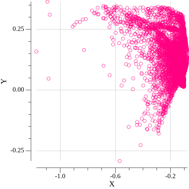
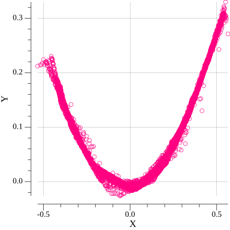

## Example for [parabola (quadratic) function](https://en.wikipedia.org/wiki/Quadratic_function):

Actual reference function:

Generated data on 0-th epoch:

Generated data on 10-th epoch:

Generated data on 60-th epoch:

Generated data on 150-th epoch:

Generated data on last epoch:

