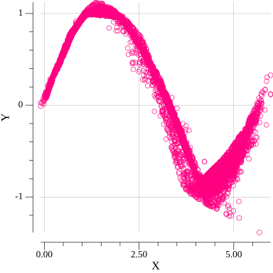
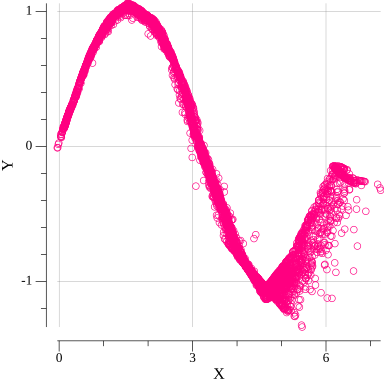
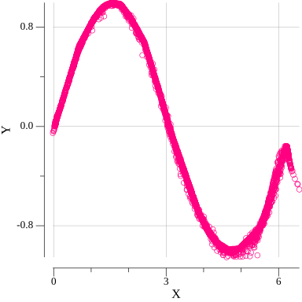

## Example for [sine function](https://en.wikipedia.org/wiki/Sine#:~:text=16%20External%20links-,Right%2Dangled%20triangle%20definition,the%20length%20of%20the%20hypotenuse.):

Actual reference function:

Generated data on 0-th epoch:

Generated data on 20-th epoch:

Generated data on 60-th epoch:

Generated data on 160-th epoch:

Generated data on last epoch:

