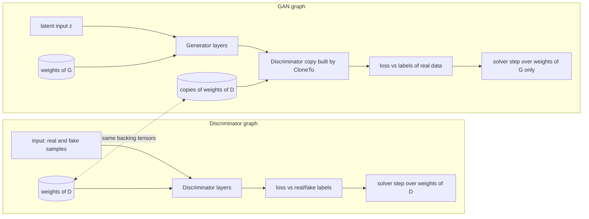

# GAN: the two-graph scheme

## The idea

A generative adversarial network [[1]](#references) is a pair of networks contesting each other. The generator $G$ maps latent noise $z$ to samples, the discriminator $D$ maps a sample to the probability of it being real. The classic objective is the minimax game

$$\min_G \max_D \; \mathbb{E}_{x \sim p_{data}}[\log D(x)] + \mathbb{E}_{z \sim p_z}[\log(1 - D(G(z)))] \tag{1}$$

Training alternates two steps:

1. Discriminator step: show $D$ a batch of real samples labeled 1 and generated samples labeled 0, update weights of $D$.
2. Generator step: feed $G(z)$ through $D$, label the output as real, update weights of $G$ only. The discriminator inside this step must stay frozen.

The examples of this repository use `MSELoss` for both steps (which corresponds to the least squares GAN objective [[2]](#references)) or `BinaryCrossEntropyLoss` (the classic objective).

## Why two graphs

Gorgonia has no way to freeze a subset of learnables inside one graph. The repository solves it structurally:

- The discriminator is defined on its own graph and trained there as a regular network.
- The GAN lives on the generator's graph and holds a structural copy of the discriminator built by `CloneTo(...)` of every layer.
- During the generator step, the solver is given `GeneratorLearnables()` only, so the copied discriminator acts as a constant with respect to the update.

To see chart I use https://mermaid.live/ mainly (it's not an AD)


## The shared memory trick

The copies of discriminator weights are new nodes on the GAN graph, but they are created with `gorgonia.WithValue(originalNode.Value())`, which binds the very same tensor (the same backing memory) to both nodes. It is not a deep copy. Since Gorgonia solvers update weights in place, every training step of the discriminator on its own graph is immediately visible to the copies inside the GAN graph. No manual synchronization exists anywhere in the code, and none is needed.

The chain is:

1. `NewGAN` calls `layer.CloneTo(ganGraph, "_gan")` for every discriminator layer, see [gan.go](../gan.go).
2. `CloneTo` of each layer uses the `cloneLearnableTo` helper, see [layer.go](../layer.go).
3. The assumption itself (value binding shares memory, solvers update in place) is guarded by `TestSharedTensorAssumption` and `TestNewGANSharedWeights` in [gan_test.go](../gan_test.go), so a semantic change in a future Gorgonia version would be caught by the test suite rather than by silently broken training.

## Where to look in the code

- [gan.go](../gan.go) holds `NewGAN` and a detailed comment about the trick.
- Any GAN example, e.g. [cmd/examples/parabola/main.go](../cmd/examples/parabola/main.go), shows the full training loop: two graphs, two tape machines, two solvers.

## References

```bibtex
% [1]
@inproceedings{goodfellow2014generative,
    title={Generative adversarial nets},
    author={Ian Goodfellow and Jean Pouget-Abadie and Mehdi Mirza and Bing Xu and David Warde-Farley and Sherjil Ozair and Aaron Courville and Yoshua Bengio},
    booktitle={Advances in Neural Information Processing Systems 27 (NIPS 2014)},
    pages={2672-2680},
    year={2014},
    note={\url{https://arxiv.org/abs/1406.2661}}
}
% [2]
@inproceedings{mao2017least,
    title={Least squares generative adversarial networks},
    author={Xudong Mao and Qing Li and Haoran Xie and Raymond Y. K. Lau and Zhen Wang and Stephen Paul Smolley},
    booktitle={Proceedings of the IEEE International Conference on Computer Vision (ICCV)},
    pages={2794-2802},
    year={2017},
    note={\url{https://arxiv.org/abs/1611.04076}}
}
```
